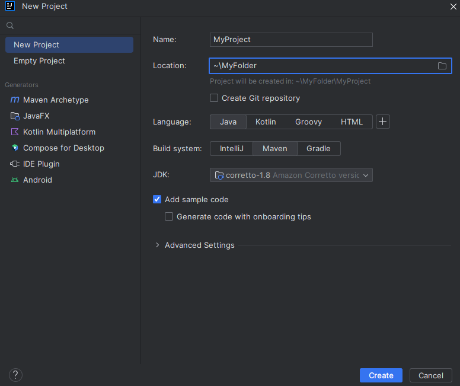
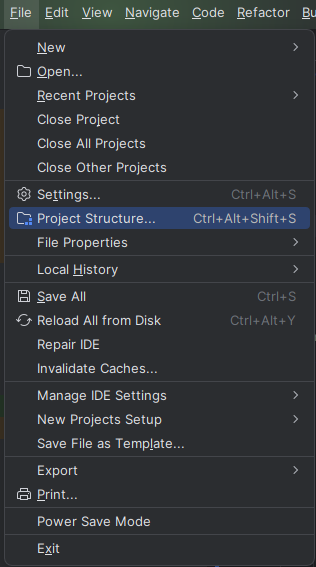
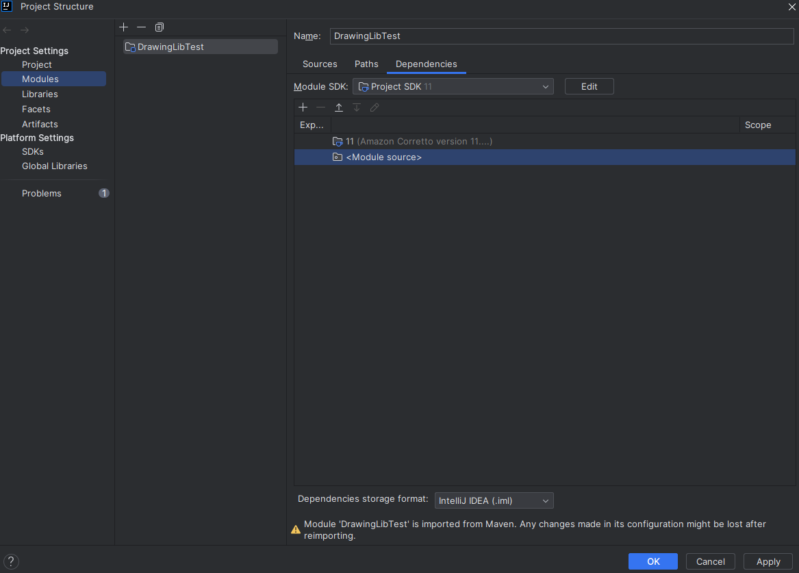
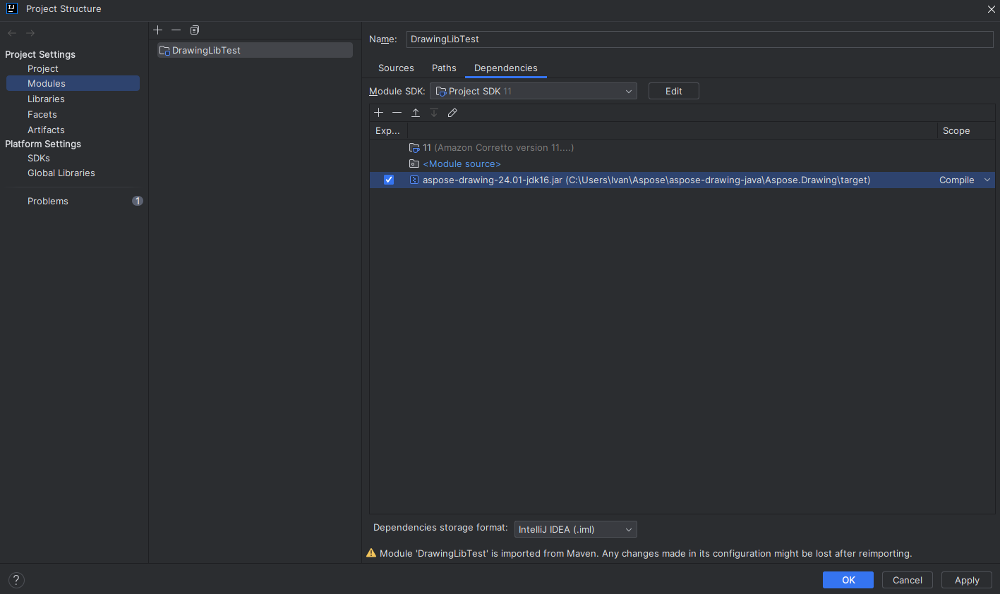
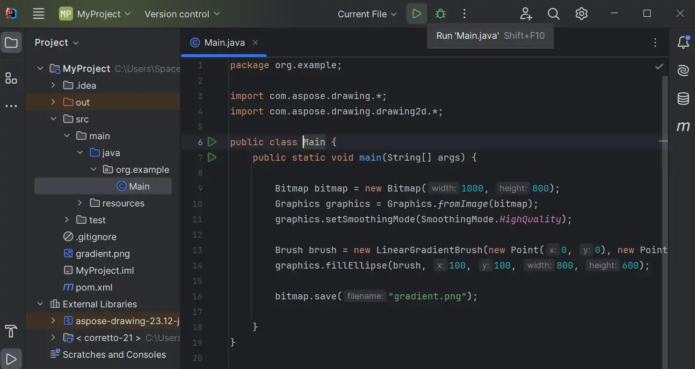

You can use Aspose.Drawing library in a cross-platform Java applications to draw vector graphics, and text, and generate images as demonstrated in this tutorial.

{}

Aspose.Drawing is a versatile and user-friendly API. This article guides you, step by step, through the process of setting up and creating your first Java application with Aspose.Drawing. Although the steps are demonstrated using IntelliJ IDEA, the procedures for other IDEs are analogous. The article includes a code example that generates your first simple drawing.

{}

Upon installation, all Aspose components operate in evaluation mode. This mode, which doesn't have a time constraint, incorporates watermarks into the generated drawings.

## Creating an Application that Uses Aspose.Drawing

To work with Aspose.Drawing in your applications:

- Download Aspose.Drawing for Java.
- Create a project.
- Add a reference to the Aspose.Drawing API.
- Write the code.

### Download Aspose.Drawing for Java

- Download <a href="https://downloads.aspose.com/drawing/java">Aspose.Drawing for Java</a>.
- Unzip the downloaded ZIP archive on your development computer, for example, `c:\Users\User\Aspose\aspose-drawing-java\Aspose.Drawing\target`.

### Create Project

- Launch the IDE IntelliJ IDEA.
- In the main toolbar click "New Project".
- Enter the project name and location.
- Click "Create" button.

### Add Reference of Aspose.Drawing for Java API

The project uses the Aspose.Drawing API as the core library for performing drawing operations. So, you have to reference the Aspose.Drawing JAR in the project.

1. Select the "Project Structure" menu (in the File menu):

2. Select the "Modules" in the "Project Settings".

3. Navigate to the "Dependencies" tab and click "+" to add a folder:

4. Select the Aspose.Drawing the target folder with JAR file for adding it to the project:

### Write **Main.java**

The next step is to create a new class.

By default, the `Main.java` file is created in the `src/main/java/org.example` folder inside the Project tree. `Main.java` file is ready for editing with the default class `Main` and method `main()`.

The code below uses the Aspose.Drawing API to create a drawing from scratch. Replace the **Main.java** file with the following code that draws a gradient and saves an image:



{}

All coding is done in the `main()` method of the class `Main`.

{}

## Run Java application

Start the project from IDE by pressing the "Run" button on the toolbar. In the project output directory, the resulting **gradient.png** image file will be generated:

<figure class="frame">

    
<figcaption>Linear gradient drawing in Java</figcaption>

</figure>
