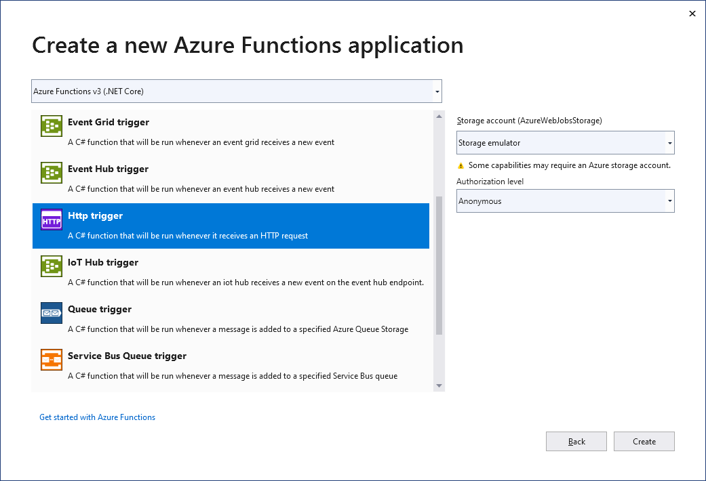
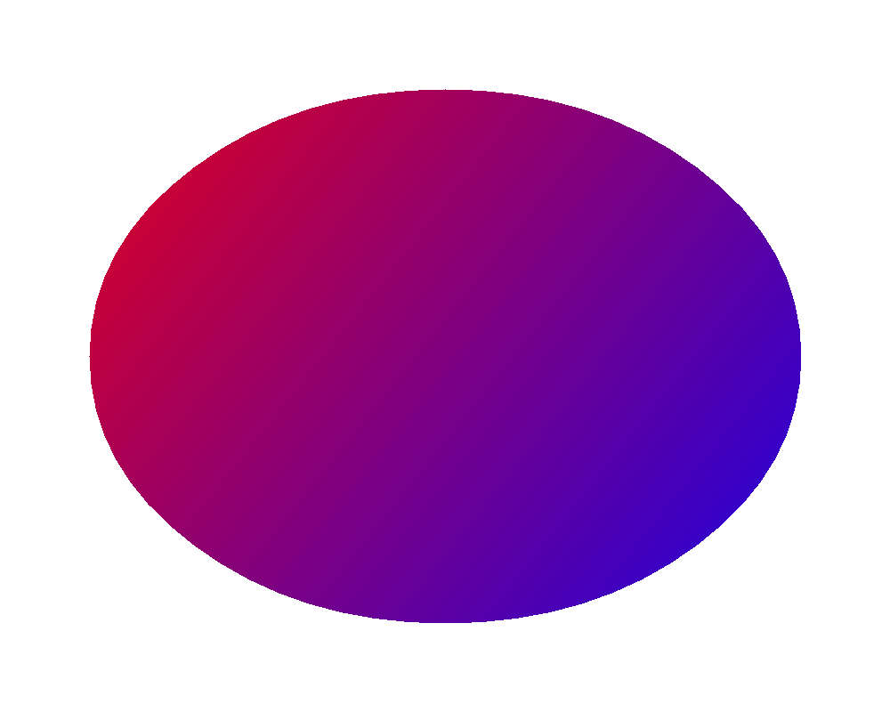

Azure Functions allows you to quickly create a module to run on the cloud infrastructure.

You can use Aspose.Drawing in your Azure Function to draw vector graphics, text, and generate resulting images as demonstrated in this tutorial.

## 1. Create a Java function app project.

Create an HTTP trigger function from **Azure Functions** project template as described in 
[Quickstart: Create your first function in Azure using Visual Studio](https://docs.microsoft.com/en-us/azure/azure-functions/functions-create-your-first-function-visual-studio#create-a-function-app-project).

## 2. Add the Aspose.Drawing package to project dependencies.

## 3. Add image drawing code.

Replace the main **Function1.cs** file with the following code that draws a gradient and returns the resulting image for an HTTP request:



## 4. Add an Aspose.Drawing license file.

Copy your **Aspose.DrawingJava.lic** file with Aspose.Drawing licensing information to the project directory, open this file properties from Solution Explorer and set **Copy to Output Directory** to **Copy always**.

## 5. Publish the project to Azure.

Publish your project to Azure as described in [Quickstart: Create your first function in Azure using Visual Studio](https://docs.microsoft.com/en-us/azure/azure-functions/functions-create-your-first-function-visual-studio#publish-the-project-to-azure).

## 6. Test your function in Azure.

In the address bar in the browser, append the string **/api/Function1** to the base URL and run the request (the full request will look like https://azurefunctionapp123456789.azurewebsitesJava/api/Function1).

The browser will display the drawing result:

