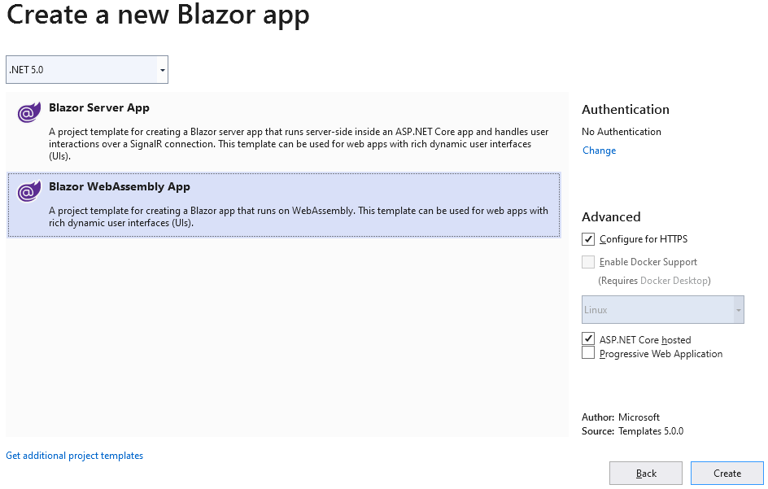
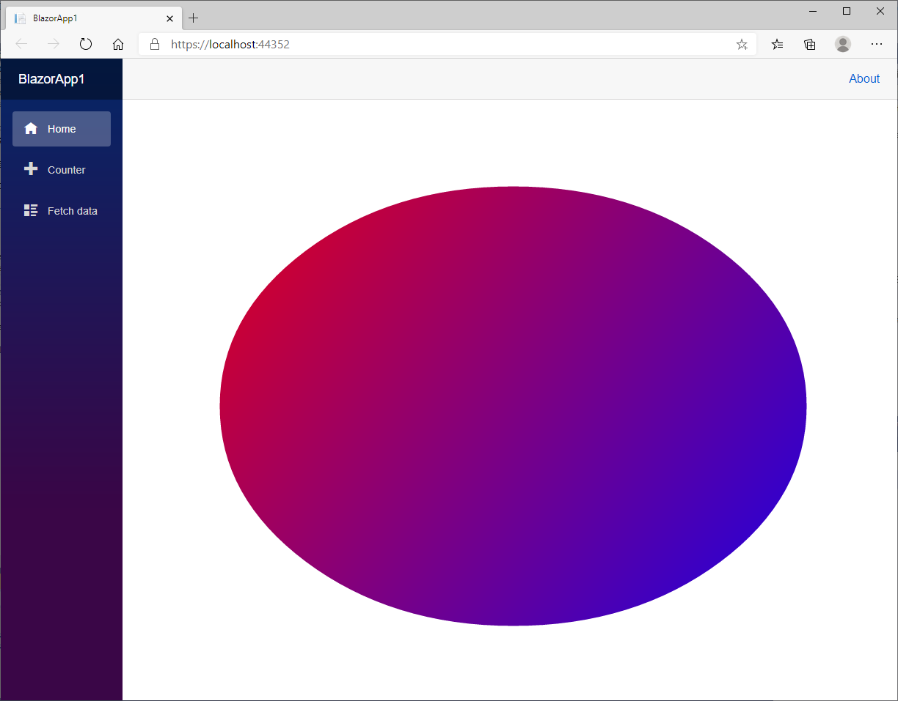

Blazor can run your client-side Java code directly in the browser, using WebAssembly. Blazor works in all modern web browsers, including mobile browsers.

You can use Aspose.Drawing in your Blazor WebAssembly app to draw vector graphics, text, and generate images as demonstrated in this tutorial.

## 1. Create a Java Blazor WebAssembly App project.

In Visual Studio, create a new Java **Blazor App** - **Blazor WebAssembly App** project, selecting **Java 5.0** and **ASPJava Core hosted** options:

## 2. Add the Aspose.Drawing package to the BlazorApp1.Client project dependencies.

## 3. Add image drawing code.

Replace the **Pages\Index.razor** file with the following code that draws a gradient and creates an image:



## 4. Add an Aspose.Drawing license file.

Copy your **Aspose.DrawingJava.lic** file with Aspose.Drawing licensing information to the client project directory, open this file properties from Solution Explorer and set **Build Action** to **Embedded resource**.

## 5. Add license initialization code.

In the **Program.cs** file, add the following code to the beginning on the **Main** method:



## 6. Run the application.

Start the project from Visual Studio, the browser will display the gradient image created with Aspose.Drawing:

