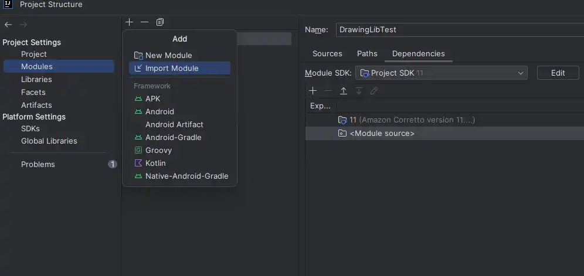
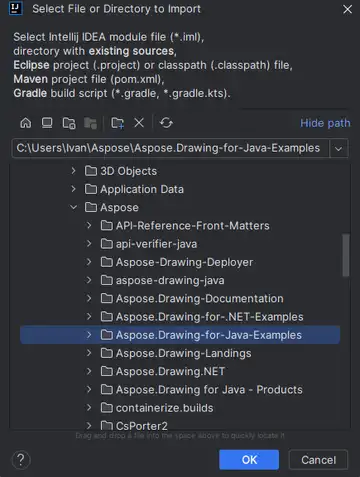
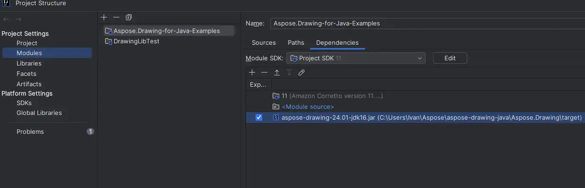
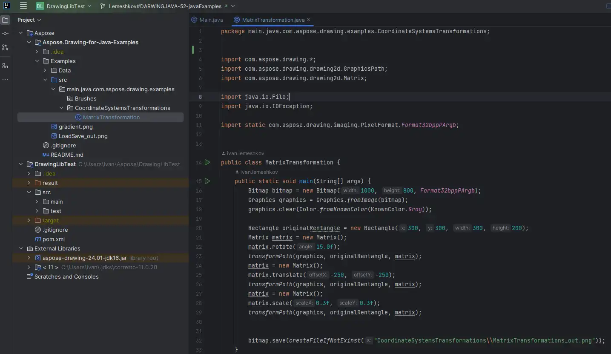

## **Download Examples from GitHub**

All examples of Aspose.Drawing for Java are hosted on [GitHub](https://github.com/aspose-drawing/Aspose.Drawing-for-Java).

- Clone the repository using your preferred GitHub client or download the ZIP file from [Aspose.Drawing-for-Java repository](https://github.com/aspose-drawing/Aspose.Drawing-for-Java/archive/master.zip).

- Unzip the contents to a folder of your choice on your computer; all examples are in the `Examples` folder.

## **Import Examples to IDE Project**

Utilize any IDE, such as an IntelliJ IDEA or Eclipse, to run the examples. Import the desired example via File -> Project Structure -> Modules -> Add -> Import Module and select the directory with sources:

## **Adding Dependencies**

Include the necessary JAR files (Libraries) to the project on the "Dependencies" tab:

Aspose.Drawing for Java examples opened in IntelliJ IDEA:

{}

You can also import the examples directly from the GitHub repository.

{}

If you have any issues setting up or running the examples, you can reach out to our <a href="https://forum.aspose.com/c/drawing/44">Forum</a>.

## **Contribute**

Feel free to contribute to the project by adding or enhancing examples. All examples and showcase projects in this repository are open source, and available for unrestricted use in your applications.

To contribute, simply fork the repository, modify the source code, and then create a pull request. We'll thoroughly review the changes and incorporate them into the repository if deemed beneficial.
