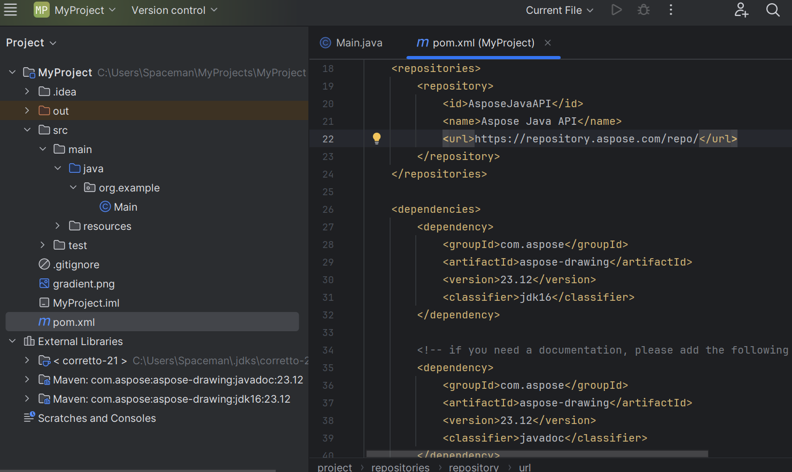
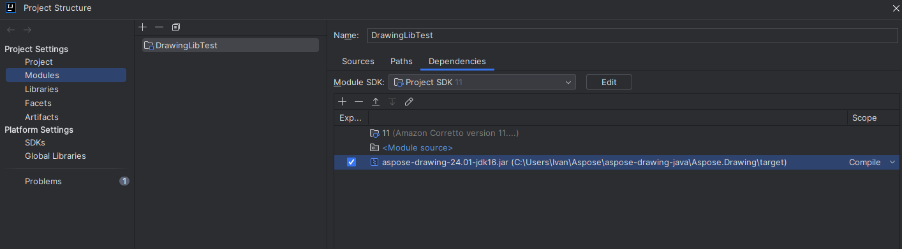

## **Installing Aspose.Drawing for Java through Maven**

<a href="https://repository.aspose.com/repo/com/aspose/">Maven repository</a> hosted by Aspose is the easiest way to download and install Aspose APIs for Java. You can use your Maven Project configuration to specify the repository configuration. Add Aspose Maven repository in your Maven `pom.xml` file: 

```xml
 <repositories>
    <repository>
        <id>AsposeJavaAPI</id>
        <name>Aspose Java API</name>
        <url>https://repository.aspose.com/repo/</url>
    </repository>
</repositories>
```

Define the following dependency for Aspose.Drawing Java in your `pom.xml` file:

```xml
 <dependencies>
    <dependency>
        <groupId>com.aspose</groupId>
        <artifactId>aspose-drawing</artifactId>
        <version>23.12</version>
        <classifier>jdk16</classifier>
   </dependency>

   <!-- if you need a documentation, please add the following dependency. For example it could be useful for IDE. -->
   <dependency>
        <groupId>com.aspose</groupId>
        <artifactId>aspose-drawing</artifactId>
        <version>23.12</version>
        <classifier>javadoc</classifier>
   </dependency>
</dependencies>
```

Aspose.Drawing for Java dependency is defined in your Maven project after finishing these steps.




## **Adding Aspose.Drawing dependency**

Alternatively, you can download the latest version of Aspose.Drawing JAR file from  <a href="https://releases.aspose.com/java/repo/com/aspose/aspose-drawing/">Aspose Repository Server</a> and add it to your project as a dependency.

If you are using IntelliJ IDEA, you can open the "Project Structure" menu, navigate to "Project Settings" -> "Modules", select the "Dependencies" tab and add the path where the Aspose.Drawing JAR is located.


