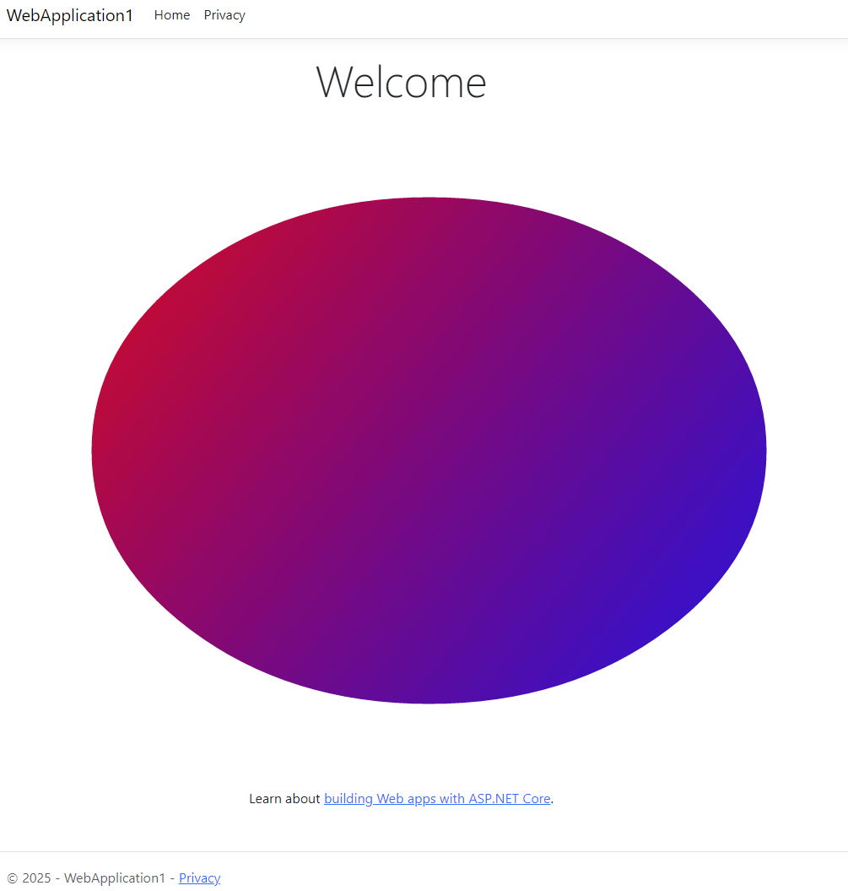

ASP.NET Core is a cross-platform, high-performance, open-source framework for building modern, cloud-enabled, Internet-connected apps.

You can use Aspose.Drawing in your ASP.NET Core applications to draw vector graphics, text, and generate images as demonstrated in this tutorial.

## 1. Create a C# ASP.NET Core project.

In Visual Studio, create a new C# **ASP.NET Core Web App (Razor Pages)** project.

## 2. Add the Aspose.Drawing.Common package to WebApplication1 project dependencies.

## 3. Add image drawing code.

Add the **Draw.cs** file with the following code that draws a gradient and creates an image:



## 4. Add an Aspose.Drawing license file.

Copy your **Aspose.Drawing.NET.lic** file with Aspose.Drawing licensing information to the project directory, open this file properties from Solution Explorer and set **Build Action** to **Embedded resource**.

Add the following code to **Program.cs - Main**:

Draw.SetLicense();

## 5. Add UI image.

In the **Pages\Index.cshtml** file, add the following element to the **div** :

&lt;img src="@Draw.DrawToString()" /&gt;

## 6. Run the application.

Start the project from Visual Studio, a browser will display the gradient image created with Aspose.Drawing:

