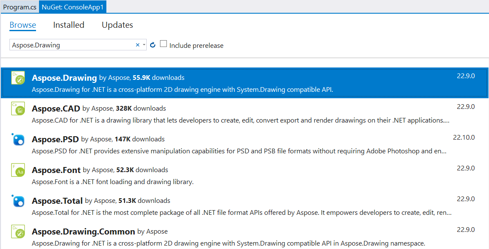

Azure Functions allows you to quickly create a module to run on the cloud infrastructure.

You can use Aspose.Drawing in your Azure Function to draw vector graphics, text, and generate resulting images as demonstrated in this tutorial.

## 1. Create a C# function app project.

Create an HTTP trigger function from **Azure Functions** project template as described in 
[Quickstart: Create your first function in Azure using Visual Studio](https://docs.microsoft.com/en-us/azure/azure-functions/functions-create-your-first-function-visual-studio#create-a-function-app-project).


## 2. Add the Aspose.Drawing package to project dependencies.



## 3. Add image drawing code.

Replace the main **Function1.cs** file with the following code that draws a gradient and returns the resulting image for an HTTP request.

```csharp
using System.IO;
using System.Threading.Tasks;
using Microsoft.AspNetCore.Mvc;
using Microsoft.Azure.WebJobs;
using Microsoft.Azure.WebJobs.Extensions.Http;
using Microsoft.AspNetCore.Http;

using System.Drawing;
using System.Drawing.Drawing2D;
using System.Drawing.Imaging;

namespace AzureFunctionApp1
{
    public static class Function1
    {
        [FunctionName("Function1")]
        public static async Task<IActionResult> Run([HttpTrigger(AuthorizationLevel.Anonymous, "get", "post", Route = null)] HttpRequest req, ExecutionContext context)
        {
            Aspose.Drawing.License license = new Aspose.Drawing.License();
            license.SetLicense(Path.Combine(context.FunctionAppDirectory, "Aspose.Drawing.NET.lic"));

            return new FileStreamResult(Draw(ImageFormat.Png), "image/png");
        }

        static Stream Draw(ImageFormat format)
        {
            Bitmap bitmap = new Bitmap(1000, 800, PixelFormat.Format32bppPArgb);
            Graphics graphics = Graphics.FromImage(bitmap);

            Brush brush = new LinearGradientBrush(new Point(0, 0), new Point(1000, 800), Color.Red, Color.Blue);
            graphics.FillEllipse(brush, 100, 100, 800, 600);

            MemoryStream result = new MemoryStream();
            bitmap.Save(result, format);
            result.Seek(0, SeekOrigin.Begin);
            return result;
        }
    }
}
```

## 4. Add an Aspose.Drawing license file.

Copy your **Aspose.Drawing.NET.lic** file with Aspose.Drawing licensing information to the project directory, open this file properties from Solution Explorer and set **Copy to Output Directory** to **Copy always**.

## 5. Publish the project to Azure.

Publish your project to Azure as described in [Quickstart: Create your first function in Azure using Visual Studio](https://docs.microsoft.com/en-us/azure/azure-functions/functions-create-your-first-function-visual-studio#publish-the-project-to-azure).

## 6. Test your function in Azure.

In the address bar in the browser, append the string **/api/Function1** to the base URL and run the request (the full request will look like https://azurefunctionapp123456789.azurewebsites.net/api/Function1).

The browser will display the drawing result:

