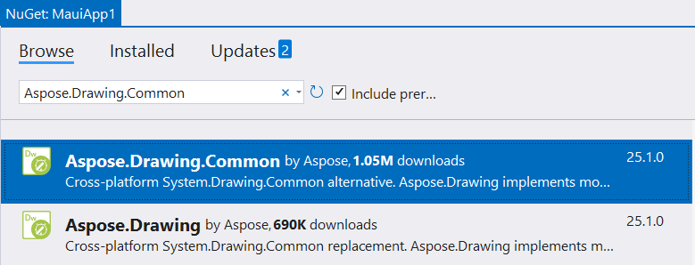
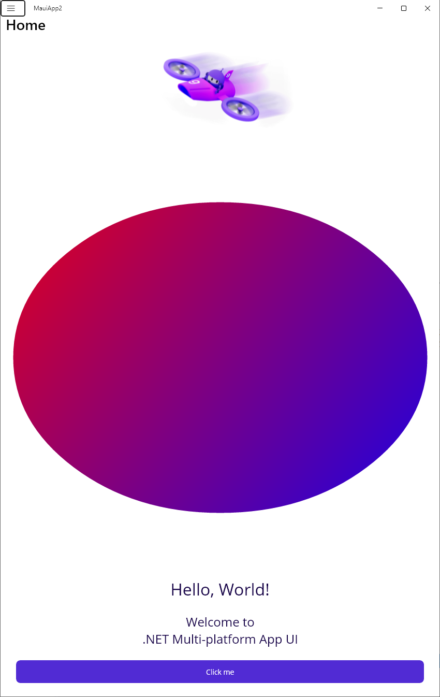

.NET Multi-platform App UI (.NET MAUI) is a cross-platform framework for creating native mobile and desktop apps with C# and XAML. Using .NET MAUI, you can develop apps that can run on Android, iOS, macOS, and Windows from a single shared code-base.

You can use Aspose.Drawing in your Maui app to draw vector graphics, text, and generate images as demonstrated in this tutorial.

## 1. Create a C# .NET MAUI App project.

In Visual Studio, create a new C# **.NET MAUI App** project, selecting **.NET 9.0** without including sample content.

## 2. Add the Aspose.Drawing.Common package to the MauiApp1 project dependencies.

## 3. Add image drawing code.

Replace the **MainPage.xaml.cs** file with the following code that draws a gradient and creates an image:



## 4. Add an Aspose.Drawing license file.

Add your **Aspose.Drawing.NET.lic** file with Aspose.Drawing licensing information to the **Resources\Raw** folder in Solution Explorer.

## 5. Add UI image.

In the **MainPage.xaml** file, add the following code to the **VerticalStackLayout** control:

&lt;Image x:Name="AsposeImage" WidthRequest="1000" HeightRequest="800" /&gt;

## 6. Run the application.

Start the project from Visual Studio, the app will display the gradient image created with Aspose.Drawing:

