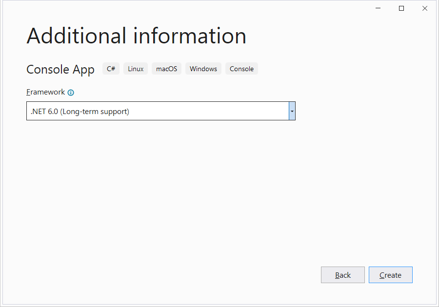
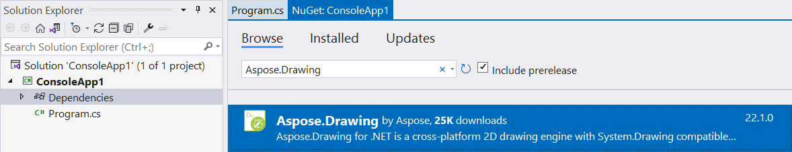

.NET 6 unifies the SDK, base libraries, and runtime across mobile, desktop, IoT, and cloud apps.

You can use Aspose.Drawing in a cross-platform .NET 6 application or library to draw vector graphics, text, and generate images as demonstrated in this tutorial.

## 1. Create a C# .NET 6 console app.

In Visual Studio 2022, create a new C# **Console App**, selecting **.NET 6.0** framework:

## 2. Add the Aspose.Drawing package to project dependencies.

## 3. Add image drawing code.

Replace the **Program.cs** file with the following code that draws a gradient and saves an image:



## 4. Add an Aspose.Drawing license file.

Copy your **Aspose.Drawing.NET.lic** file with Aspose.Drawing licensing information to the project directory, open this file properties from Solution Explorer and set **Build Action** to **Embedded resource**.

## 5. Run the application.

Start the project from Visual Studio, in the project output directory the resulting **gradient.png** image file will be generated:

## 6. Comparison with System.Drawing.Common.

System.Drawing.Common by Microsoft is the original implementation of System.Drawing graphics library. System.Drawing.Common was designed to be a thin wrapper over Windows technologies, with limited cross-platform implementation. In .NET 6 the System.Drawing.Common NuGet package is attributed as a Windows-specific library and is only supported on Windows operating systems. The platform analyzer emits warning at compile time when compiling for non-Windows operating systems. For example, the previous .NET 6 console application code generates multiple warnings like:

warning CA1416: This call site is reachable on all platforms. 'Image.Save(string)' is only supported on: 'windows'.

In comparison, Aspose.Drawing is implemented in fully managed code and provides true cross-platform support for the same System.Drawing API.
