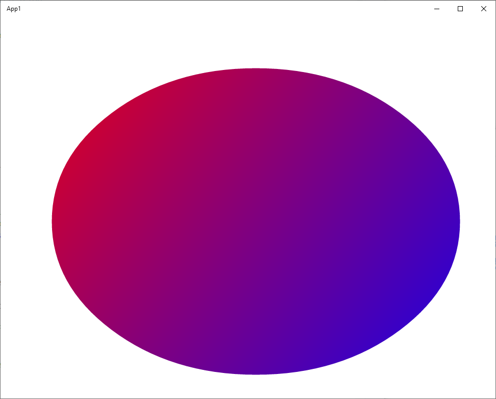

WinUI 2 provides official native Windows UI controls and other user interface elements for UWP applications (and desktop applications using XAML Islands).

You can use Aspose.Drawing in your WinUI 2 app to draw vector graphics, text, and generate images as demonstrated in this tutorial.

## 1. Create a C# UWP App project.

In Visual Studio, create a new C# **UWP Blank App** project.

## 2. Add the Aspose.Drawing.Common package to App1 project dependencies.

## 3. Add image drawing code.

Replace the **MainPage.xaml.cs** file with the following code that draws a gradient and creates an image:



## 4. Add an Aspose.Drawing license file.

Add your **Aspose.Drawing.NET.lic** file with Aspose.Drawing licensing information to the **Assests** folder in Solution Explorer.

Add **async** to **OnLaunched** declaration in **App.xaml.cs** and the following code:

await MainPage.SetLicense();

## 5. Add UI image.

Add Microsoft.UI.Xaml package to App1 project dependencies.

In the **MainPage.xaml** file, add the following code to **Page** and **Grid**:

xmlns:muxc="using:Microsoft.UI.Xaml.Controls"

&lt;muxc:ImageIcon x:Name="AsposeImage" /&gt;

## 6. Run the application.

Start the project from Visual Studio, the app will display the gradient image created with Aspose.Drawing:

