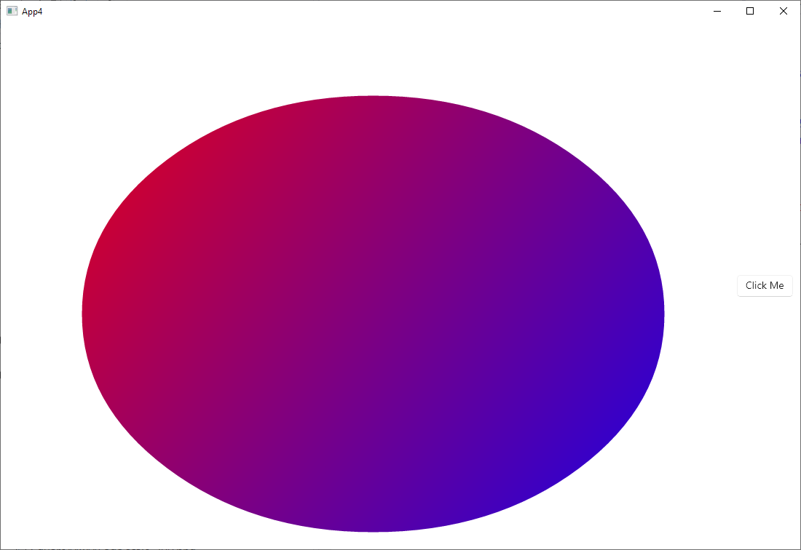

WinUI 3 is the native UI platform component that ships with the Windows App SDK (completely decoupled from Windows SDKs). The Windows App SDK provides a unified set of APIs and tools that can be used to create production desktop apps that target Windows 10 and later, and can be published to the Microsoft Store.

You can use Aspose.Drawing in your WinUI 3 app to draw vector graphics, text, and generate images as demonstrated in this tutorial.

## 1. Create a C# WinUI 3 App project.

In Visual Studio, create a new C# **Blank App, Packaged (WinUI 3 in desktop)** project.

## 2. Add the Aspose.Drawing.Common package to App1 project dependencies.

## 3. Add image drawing code.

Replace the **MainWindow.xaml.cs** file with the following code that draws a gradient and creates an image:



## 4. Add an Aspose.Drawing license file.

Add your **Aspose.Drawing.NET.lic** file with Aspose.Drawing licensing information to the **Assests** folder in Solution Explorer.

Add **async** to **OnLaunched** declaration in **App.xaml.cs** and the following code:

await MainWindow.SetLicense();

## 5. Add UI image.

In the **MainWindow.xaml** file, add the following element to the **StackPanel** control:

&lt;Image x:Name="AsposeImage" /&gt;

## 6. Run the application.

Start the project from Visual Studio, the app will display the gradient image created with Aspose.Drawing:

