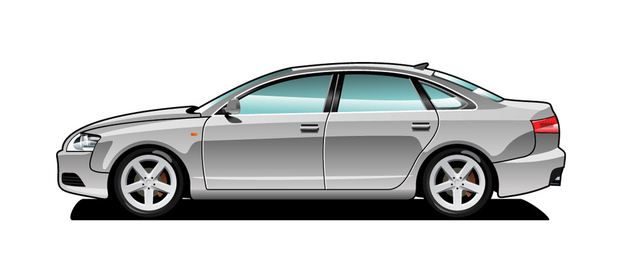
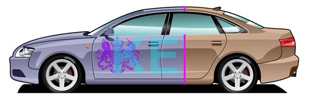

## Creating Car Body Drawing

<p align='justify'>
&nbsp;&nbsp;&nbsp;&nbsp;&nbsp;&nbsp;&nbsp;&nbsp;
The Aspose.Drawing .NET (C#) 2d graphic library provides designers with a powerful tool for creating captivating drawings. You can combine different images and text strings with semi-transparency to create unique drawings. In the following example, we'll take a car image, coloring the body and incorporate a logo image with text, blending them on the car's body. By using semi-transparency in the blending process, we can maintain the visibility of reflections on the car's body surface. We'll apply color to the car by utilizing a semi-transparent layer and a clipping region that covers only the car body, excluding the wheels and windows. Moreover, we'll simulate the process of applying and blending various "skins" with a laser beam to showcase a dynamic transition between these skins.
</p>

<style>
   .frame {
    border: 2px solid darkgray;
    padding: 5px;
    margin: 10px 0 5px 5px;
    background: #f0f0f0;
    align-items: center;
   }
   .marginauto {
    margin: 10px auto 20px;
    display: block;
   }
   .frame figcaption {
    margin: 0 auto;
    display: flex;
    flex-direction: row;
    justify-content: center;
   }
   .container {
    display: flex;
    flex-direction: row;
    align-items: center;
    justify-content: space-around;
   }
</style>

<figure class="frame">
<div class="container">
    <div>
        <figcaption>Logo image</figcaption>
    </div>
    <div>
        <figcaption>Car body image</figcaption>
    </div>
</div>
<div class="container">
    <div>
        
    </div>
    <div>
        
    </div>
</div>
<figcaption>Source images</figcaption>
</figure>

<p align='justify'>
&nbsp;&nbsp;&nbsp;&nbsp;&nbsp;&nbsp;&nbsp;&nbsp;
To demonstrate the drawing capabilities, let's create various skin designs for the car's body image. The `Skin` class comprises a background color, and within it, the `DesignElement` class further consists of a `Banner` class containing a text string and a `Logo` class with image attributes. Now you can assign different skins with background colors using the <a href="https://reference.aspose.com/drawing/net/aspose.drawing/color/fromargb/#fromargb_3">Color.FromArgb</a> method. The `FromArgb()` method creates a new skin color with parameters and the first one is the alpha layer to determine transparency levels. So, skins number 1 and 2 in the code example below will use only a colored background, while skins 3 and 4 use additional `DesignElements` with a logo image, a position, and the banner text strings "KEWIN" and "ANCHOR," respectively. Define a font name, size, style and color per each `Banner` element:
</p>



### Car body coloration

<p align='justify'>
&nbsp;&nbsp;&nbsp;&nbsp;&nbsp;&nbsp;&nbsp;&nbsp;
Next, we create a `GraphicsPath` object named `carBody`, which outlines the car image using Bezier curves. We then incorporate a new Bitmap frame created from both the `carBody` and the skin using the `DrawFrame` function:
</p>



<p align='justify'>
&nbsp;&nbsp;&nbsp;&nbsp;&nbsp;&nbsp;&nbsp;&nbsp;
The `DrawFrame` function creates new `Bitmap` graphics with dimensions `w x h` and a white background color. We enable graphics smoothing with high quality and text rendering hinting with anti-aliasing attributes. Following that, we load a source car body PNG image file and use the <a href="https://reference.aspose.com/drawing/net/aspose.drawing/graphics/drawimage/#drawimage_14">Graphics.DrawImage method</a> to render it onto the bitmap. Additionally, we fill the interior of the car body's `GraphicsPath` with the skin's background color using the <a href="https://reference.aspose.com/drawing/net/aspose.drawing/graphics/fillpath/">FillPath method</a>. This way, the background color will only be applied to the region defined by the `carBody` outline:
</p>



<p align='justify'>
&nbsp;&nbsp;&nbsp;&nbsp;&nbsp;&nbsp;&nbsp;&nbsp;
If our skin includes a `Banner` text and a `Logo` image, we will also render them onto the graphics using the <a href="https://reference.aspose.com/drawing/net/aspose.drawing/graphics/drawstring/#drawstring_4">DrawString</a> and <a href="https://reference.aspose.com/drawing/net/aspose.drawing/graphics/drawimage/#drawimage_14">DrawImage</a> methods. We use <a href="https://reference.aspose.com/drawing/net/aspose.drawing/graphics/clip/">Graphics.Clip property</a> to ensure that the drawn text string and image logo are confined to the clip region corresponding to the `carBody` outline:
</p>



### Transparent bitmap blending

<p align='justify'>
&nbsp;&nbsp;&nbsp;&nbsp;&nbsp;&nbsp;&nbsp;&nbsp;
Now, we have two bitmaps: one featuring a colored car body and the second representing a text string and logo image. To blend these bitmaps while preserving semi-transparency, we can employ the `DrawImage` method, but with an added <a href="https://reference.aspose.com/drawing/net/aspose.drawing.imaging/imageattributes/">ImageAttributes</a> parameter. We create a <a href="https://reference.aspose.com/drawing/net/aspose.drawing.imaging/colormatrix/colormatrix/#constructor_1">ColorMatrix</a> where one of its elements, responsible for transparency, is set to a value of 0.7. This matrix is then utilized as an image attribute using the <a href="https://reference.aspose.com/drawing/net/aspose.drawing.imaging/imageattributes/setcolormatrix/#setcolormatrix_2">SetColorMatrix</a> method:
</p>



### Mixing two bitmaps

<p align='justify'>
&nbsp;&nbsp;&nbsp;&nbsp;&nbsp;&nbsp;&nbsp;&nbsp;
Furthermore, we can mix bitmap frames that feature various skins into a sequence of images, which can then be saved to files in the PNG format. This allows two skins to be simultaneously blended into the car body image, separated by an edge line. To create a mixed bitmap we assign two objects `frame1` and `frame2` with current and next bitmaps skins:
</p>



<p align='justify'>
&nbsp;&nbsp;&nbsp;&nbsp;&nbsp;&nbsp;&nbsp;&nbsp;
We will mix two bitmaps with different skins to create a new one, gradually changing the proportion from 0% to 100%. On this resulting bitmap, we will use the <a href="https://reference.aspose.com/drawing/net/aspose.drawing/graphics/drawimage/#drawimage_9">DrawImage</a> method to draw the left portion from 'frame1' and the right portion from 'frame2', divided by a vertical edge line whose position is determined by the 'percent' variable:
</p>



### Drawing laser edge line

<p align='justify'>
&nbsp;&nbsp;&nbsp;&nbsp;&nbsp;&nbsp;&nbsp;&nbsp;
Additionally, we will draw a laser vertical line between the two bitmaps, which will be 5 pixels wide. To achieve this, we create a rectangle at a position that corresponds to the percentage of the skin bitmaps mixing proportion. We then obtain the region, which is an intersection of our rectangle and the `carBody` graphics path, using the <a href="https://reference.aspose.com/drawing/net/aspose.drawing/region/intersect/#intersect_1">Region.Intersect</a> method. Finally, we fill this region with a magenta-colored brush.
</p>



### Resulting drawings

<p align='justify'>
&nbsp;&nbsp;&nbsp;&nbsp;&nbsp;&nbsp;&nbsp;&nbsp;
By utilizing a straightforward Aspose.Drawing API to draw images and text strings, fill regions with semi-transparent colors, and blend bitmaps, we've crafted complex drawings. Thanks to the transparency, the resulting car body images take on new colors, as do the logo image and text drawings. In the example drawing below, you can observe two skins simultaneously applied to the car body, separated by a simulated laser beam:
</p>

<figure class="frame"><p>
    
<figcaption>Car body drawing</figcaption>
</p></figure>

### Showcase video

<p align='justify'>
&nbsp;&nbsp;&nbsp;&nbsp;&nbsp;&nbsp;&nbsp;&nbsp;
Finally, you can convert the series of PNG images with mixed skins into MP4 video with 30 frames per second and H.264 codec using `ffmpeg` program:
</p>

```sh
ffmpeg -framerate 30 -i ./out/%%05d.png -vcodec libx264 -pix_fmt yuv420p ./out/CarBody.mp4
```

<script type="application/ld+json">
{
    "@context": "https://schema.org/",
    "@type": "VideoObject",
    "name": "Car Body drawing",
    "duration": "PT00M30S",
    "uploadDate": "2023-09-16",
    "embedUrl": "https://www.youtube.com/embed/xvEuQHaHWrk",
    "thumbnailUrl": "https://i9.ytimg.com/vi/xvEuQHaHWrk/mqdefault.jpg?sqp=CMi6oKgG-oaymwEmCMACELQB8quKqQMa8AEB-AH-CYAC0AWKAgwIABABGFUgVihlMA8=&rs=AOn4CLAAyl52MFXaz0bGBtDwjlO_vH9-5Q",
    "description": "Creating Car Body drawing with Aspose.Drawing .NET (C#) 2d graphic library"
}
</script>

<iframe class="youtube-player" type="text/html" width="640" height="360" src="https://www.youtube.com/embed/xvEuQHaHWrk" title="CarBody" frameborder="0" allow="accelerometer; autoplay; clipboard-write; encrypted-media; gyroscope; picture-in-picture; web-share" allowfullscreen></iframe>

### Source code

Please see the full C# code example on the Aspose.Drawing Github: [CarBody.cs](https://github.com/aspose-drawing/Aspose.Drawing-for-.NET/blob/master/Examples/Showcases/Showcases/CarBody.cs)
