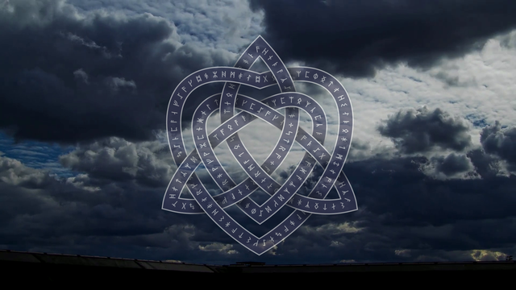
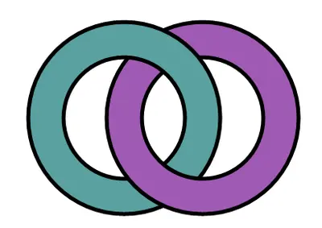
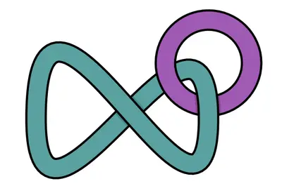

## Creating semi-transparent Celtic Heart figure text

<p align='justify'>
&nbsp;&nbsp;&nbsp;&nbsp;&nbsp;&nbsp;&nbsp;&nbsp;
The first impression is crucial when introducing new content to customers or viewers. Creating splash screens or digital art objects can be accomplished more quickly and effectively with a powerful tool like the Aspose.Drawing 2d graphic library for .NET (C#). You can leverage a variety of ready-to-use functions from the library's API for text and image drawings, manipulate graphic objects with controlled transparency levels, and blend bitmaps to craft stunning art objects.
</p>

<p align='justify'>
&nbsp;&nbsp;&nbsp;&nbsp;&nbsp;&nbsp;&nbsp;&nbsp;
In our showcase example, we craft a drawing featuring Celtic rune text drawn along an intricate, curvy path that resembles a heart shape with multiple intersections. At the center of this design, we employ a 10-node knot with semi-intersections, represented by a semi-transparent graphic path. While it may appear complex initially, we'll guide you through the showcase with step-by-step C# code examples.
</p>

<style>
   .frame {
    border: 2px solid darkgray;
    padding: 5px;
    margin: 10px 0 5px 5px;
    background: #f0f0f0;
    align-items: center;
   }
   .marginauto {
    margin: 10px auto 20px;
    display: block;
   }
   .frame figcaption {
    margin: 0 auto;
    display: flex;
    flex-direction: row;
    justify-content: center;
   }
   .container {
    display: flex;
    flex-direction: row;
    align-items: center;
    justify-content: space-around;
   }
</style>

<figure class="frame"><p>
    
<figcaption>Celtic Heart figure text</figcaption>
</p></figure>

### Nodes and ribbons

<p align='justify'>
&nbsp;&nbsp;&nbsp;&nbsp;&nbsp;&nbsp;&nbsp;&nbsp;
Let's begin with a basic example. In the illustration below, you can observe two simple unknot paths represented by cyan and magenta circles, which are linked together, forming a structure known as the Hopf Link. These paths intersect at 2 points, or in other words, the figure comprises 2 nodes. Simultaneously, we can observe 2 ribbons, with the cyan ribbon passing over the magenta ribbon at one node, and vice versa magenta over the cyan at the second node. In the second illustration, an extra node is introduced due to the self-intersection of the cyan path.
</p>

<figure class="frame">
<div class="container">
    <div>
        <figcaption>Hopf Link</figcaption>
    </div>
    <div>
        <figcaption>Self-intersection</figcaption>
    </div>
</div>
<div class="container">
    <div>
        
    </div>
    <div>
        
    </div>
</div>
<figcaption>Ribbon path drawing</figcaption>
</figure>

<p align='justify'>
&nbsp;&nbsp;&nbsp;&nbsp;&nbsp;&nbsp;&nbsp;&nbsp;
In our Celtic Heart showcase, we created a figure that also consists of two linked paths. The internal path is a knot with 10 nodes (and accordingly, 10 self-intersections), while the external second path resembles a large heart and has 6 intersections with the first path. In three nodes, the second path crosses above the first one, and in three other nodes, it goes below another path.
</p>

<p align='justify'>
&nbsp;&nbsp;&nbsp;&nbsp;&nbsp;&nbsp;&nbsp;&nbsp;
We create a `Node` object that describes the point where paths intersect. The path contains multiple alternations where the path passes beneath and then above another path. Therefore, each Node connects to one ribbon that takes the upper route and two ribbons that hide beneath the upper ribbon. Consequently, the `Ribbon` object has its path with three Nodes: the starting Node, where the ribbon begins from beneath an upper ribbon, the Node where the ribbon takes the upper route above another ribbon, and the ending Node, where the ribbon once again goes beneath another ribbon. Additionally, the ribbon includes its text and a list of shifts that indicate the positions, angles, and corrections (hints) for each text symbol.
</p>



### Celtic runes text

<p align='justify'>
&nbsp;&nbsp;&nbsp;&nbsp;&nbsp;&nbsp;&nbsp;&nbsp;
Each ribbon contains a random text string composed of runic symbols. In the showcase video, these symbols move and disappear under the upper ribbon, while new symbols appear from the other side of the same ribbon segment. To achieve this effect, we randomly select runic symbols from the initial list of 52 runic symbols and add them to the string during the string shift, ensuring that the new symbol is different from its neighbor. This is accomplished by removing the neighbor symbol from the initial list once it has been selected.
</p>



### Creating path and ribbon objects

<p align='justify'>
&nbsp;&nbsp;&nbsp;&nbsp;&nbsp;&nbsp;&nbsp;&nbsp;
We outlined our two paths using Bezier curves, and subsequently, we flattened each curve into a sequence of connected line segments utilizing the <a href="https://reference.aspose.com/drawing/net/aspose.drawing.drawing2d/graphicspath/flatten/">GraphicsPath.Flatten</a> method. Following this, we generated arrays of point objects that depict the path by accessing the <a href="https://reference.aspose.com/drawing/net/aspose.drawing.drawing2d/graphicspath/pathpoints/">GraphicsPath.PathPoints property</a>. From these points, we structured segments, each comprising a list of spans described by two consecutive points, achieved through the `AddSpans` procedure.
</p>



<p align='justify'>
&nbsp;&nbsp;&nbsp;&nbsp;&nbsp;&nbsp;&nbsp;&nbsp;
We compared all spans within segments to each other and detected intersections using the `FindIntersection()` function. If the spans intersected, we populated the nodes list with these intersected segments and distinguished nodes with alternating properties like even-odd, indicating whether the path goes above or below the crossing path. In our scenario with two paths, we only needed to fix this alternation for the last node. Subsequently, we crafted ribbons from the segments of the second path, followed by those from the first path using the `MakeRibbons`, and calculated shifts for symbol placements using the `CalcShifts` procedures.
</p>



### Draw ribbons with shadows

<p align='justify'>
&nbsp;&nbsp;&nbsp;&nbsp;&nbsp;&nbsp;&nbsp;&nbsp;
Now that we have created all the ribbon and node objects with their respective properties, we can begin generating image frames for the showcase video. For each video frame, we draw the ribbons with text and mix the frame with a background image. Additionally, after every 60 frames, we will shift symbols in the ribbon text.
</p>



<p align='justify'>
&nbsp;&nbsp;&nbsp;&nbsp;&nbsp;&nbsp;&nbsp;&nbsp;
To draw a ribbon, we employ the <a href="https://reference.aspose.com/drawing/net/aspose.drawing/graphics/drawpath/">Graphics.DrawPath</a> method, using a Pen tool corresponding to the border and inner path width. Furthermore, we draw a shadow that falls from the upper ribbon onto the underlying ribbons. To achieve this shadow image effect, we define a new inner path using the <a href="https://reference.aspose.com/drawing/net/aspose.drawing.drawing2d/graphicspath/widen/">GraphicsPath.Widen</a> method, which takes into account the width of the border pen. Subsequently, we apply a Brush tool with an elliptical gradient that smoothly transitions from black to the surrounding color. This gradient has levels of transparency, gradually decreasing from 255 to 0, and is directed towards the centers of the ribbon's starting and ending nodes.
</p>



<p align='justify'>
&nbsp;&nbsp;&nbsp;&nbsp;&nbsp;&nbsp;&nbsp;&nbsp;
After applying shadows to the bottom ribbon, we need to redraw the region where the ribbons intersect to make the upper ribbon semi-transparent. This intersection region is located at the middle point of 'Node2' on the upper ribbon. To create this region, we combine the path from the two underlying ribbons using the 'MakeUnderPart()' function. Then, we find the intersection region between the upper and bottom ribbons using the <a href="https://reference.aspose.com/drawing/net/aspose.drawing/region/intersect/#intersect_1">Region.Intersect method</a>. For this specific clip region, we apply a transparent background and redraw all three corresponding ribbons once more.
</p>



### Text rendering

<p align='justify'>
&nbsp;&nbsp;&nbsp;&nbsp;&nbsp;&nbsp;&nbsp;&nbsp;
Text rendering is accomplished by employing the <a href="https://reference.aspose.com/drawing/net/aspose.drawing.drawing2d/graphicspath/addstring/">GraphicsPath.AddString method</a> and <a href="https://reference.aspose.com/drawing/net/aspose.drawing/graphics/fillpath/">Graphics.FillPath method</a> in conjunction with the chosen font and brush. Before this, we need to calculate the positions of the text symbols for each frame during the 60-frame interval. This involves determining the X and Y coordinates, as well as the angle and correction (hint) for each symbol's placement. The corrections to the Y coordinates of the symbols are essential to ensure that the symbols do not come into contact with the ribbon borders or neighboring symbols, especially when there are significant rotation angles involved. These transformations and rotations are then applied using the <a href="https://reference.aspose.com/drawing/net/aspose.drawing/graphics/translatetransform/">Graphics.TranslateTransform</a> and <a href="https://reference.aspose.com/drawing/net/aspose.drawing/graphics/rotatetransform/">Graphics.RotateTransform</a> methods.
</p>



### Bitmaps blending with background images

<p align='justify'>
&nbsp;&nbsp;&nbsp;&nbsp;&nbsp;&nbsp;&nbsp;&nbsp;
Finally, we need to blend the two bitmaps containing our Celtic heart ribbons and background image. To preserve semi-transparency, we create a <a href="https://reference.aspose.com/drawing/net/aspose.drawing.imaging/colormatrix/colormatrix/#constructor_1">Color matrix</a> with a transparency level of 0.55 and assign it to the <a href="https://reference.aspose.com/drawing/net/aspose.drawing.imaging/imageattributes/">Image Attributes</a> parameter used by the <a href="https://reference.aspose.com/drawing/net/aspose.drawing/graphics/drawimage/#drawimage_4">Graphics.DrawImage</a> method.
</p>



### Showcase video

<p align='justify'>
&nbsp;&nbsp;&nbsp;&nbsp;&nbsp;&nbsp;&nbsp;&nbsp;
Before beginning the showcase generation, we need to prepare background frames from an existing video using the `ffmpeg` program:
</p>

```sh
ffmpeg -i CelticHeart/RooftopClouds.mp4 ./CelticHeart/RooftopClouds_out/%%05d.png
ffmpeg -i CelticHeart/StarrySky.mp4 ./CelticHeart/StarrySky_out/%%05d.png
```

<p align='justify'>
&nbsp;&nbsp;&nbsp;&nbsp;&nbsp;&nbsp;&nbsp;&nbsp;
To create a video from individual frames saved as PNG files and add audio, you can execute the following commands:
</p>

```sh
ffmpeg -framerate 30 -i ./out/%%05d.png -vcodec libx264 -pix_fmt yuv420p ./out/out.mp4
ffmpeg -i ./out/out.mp4 -i Nakarada.mp3 -map 0:v -map 1:a -c:v copy -shortest ./out/CelticHeart.mp4
```

<script type="application/ld+json">
{
    "@context": "https://schema.org/",
    "@type": "VideoObject",
    "name": "Celtic Heart figure text",
    "duration": "PT03M50S",
    "uploadDate": "2023-09-16",
    "embedUrl": "https://www.youtube.com/embed/TkCpEYy8Ong",
    "thumbnailUrl": "https://i9.ytimg.com/vi/TkCpEYy8Ong/mqdefault.jpg?sqp=CMi6oKgG-oaymwEmCMACELQB8quKqQMa8AEB-AH-CYAC0AWKAgwIABABGEkgVChlMA8=&rs=AOn4CLC4YKu2NhaS4pRGgd81tjsqPn-J1g",
    "description": "Creating semi-transparent Celtic Heart figure text drawing with Aspose.Drawing .NET (C#) 2d graphic library"
}
</script>

<iframe class="youtube-player" type="text/html" width="640" height="360" src="https://www.youtube.com/embed/TkCpEYy8Ong" title="Celtic Heart" frameborder="0" allow="accelerometer; autoplay; clipboard-write; encrypted-media; gyroscope; picture-in-picture; web-share" allowfullscreen></iframe>

### Source code

You can find the full C# source code of the showcase in the Aspose.Drawing Github repository: <a href="https://github.com/aspose-drawing/Aspose.Drawing-for-.NET/blob/master/Examples/Showcases/Showcases/CelticHeart.cs">CelticHeart.cs</a>
