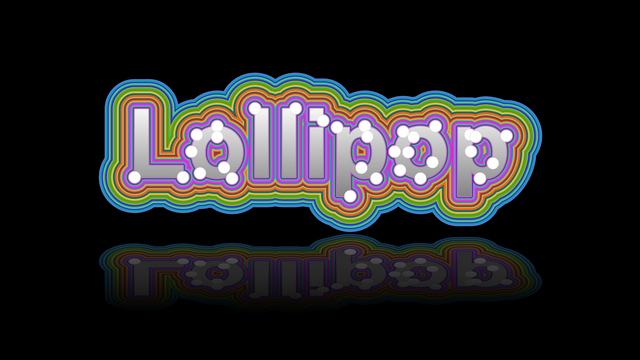

## Creating Lollipop Font

&nbsp;&nbsp;&nbsp;&nbsp;&nbsp;&nbsp;&nbsp;&nbsp;
Using the Aspose.Drawing 2D graphic library for .NET (C#), you can effortlessly create fascinating drawings. This graphic library provides the capability to work with various font families, styles, sizes, and colors, enabling the transformation of ordinary fonts into graphic art. It empowers you to manipulate graphic objects and create colored outlines around font characters.

<figure class="frame">

    
<figcaption>Lollipop Font drawing</figcaption>

</figure>

&nbsp;&nbsp;&nbsp;&nbsp;&nbsp;&nbsp;&nbsp;&nbsp;
To demonstrate the capabilities of the graphic library, we will create a text drawing in a lollipop-inspired style. Beginning with the word "Lollipop" as our base text string, we will enhance it with vibrant outlines. To add intrigue to the font, we'll decorate the edges with circular white "nuts," each measuring 35 pixels in diameter. For a dynamic showcase video, we'll gradually reduce the nut size by 1 pixel during each consequent 20 frames. In each frame, we will render the word "Lollipop" on a black background, complete with a mirrored reflection to simulate a water reflection image effect. Finally, we will save each resulting image frame as a separate PNG file.



### Drawing word letters

&nbsp;&nbsp;&nbsp;&nbsp;&nbsp;&nbsp;&nbsp;&nbsp;
Initially, generate a bitmap graphic with dimensions of `w x h`, where `w` corresponds to the width of the word's characteristics, and `h` is three times the font size's height. Enable high-quality smoothing mode and set a black background color. We will use the "Arial" font family and center the string alignment.



&nbsp;&nbsp;&nbsp;&nbsp;&nbsp;&nbsp;&nbsp;&nbsp;
We utilize the <a href="https://reference.aspose.com/drawing/net/aspose.drawing.drawing2d/graphicspath/addstring/#addstring_2">GraphicsPath.AddString</a> method to incorporate the word into a graphics path. Following that, in the `VisitPoints` procedure, we generate a list of points that align with this path. For every fifth point along the path, we introduce a circle of "nuts" using the <a href="https://reference.aspose.com/drawing/net/aspose.drawing.drawing2d/graphicspath/addellipse/#addellipse">GraphicsPath.AddEllipse</a> method, but only if the distance between two nut points exceeds 12 pixels.



### Selecting lollipop colors

&nbsp;&nbsp;&nbsp;&nbsp;&nbsp;&nbsp;&nbsp;&nbsp;
Next, we'll assemble a palette of 30 colors for our lollipop-style drawing. This entails creating two sets of colors: the first set is for background colors, and the second set comprises the basic palette colors. By blending these two sets, we'll obtain our lollipop colors.

&nbsp;&nbsp;&nbsp;&nbsp;&nbsp;&nbsp;&nbsp;&nbsp;
For the initial 30 background colors, we'll take a two-part approach. The first 15 colors will be randomly selected from the RGB color space, while the next 15 will be calculated as complementary colors to the first part. Subsequently, we'll select 30 palette colors for the second color set. These colors will be evenly distributed, with the starting point chosen randomly from a predefined palette image file "palette.png". The selection of each specific color will be accomplished using the <a href="https://reference.aspose.com/drawing/net/aspose.drawing/color/fromargb/#fromargb_2">Color.FromArgb</a> method.

&nbsp;&nbsp;&nbsp;&nbsp;&nbsp;&nbsp;&nbsp;&nbsp;
To derive our final lollipop colors, we'll blend palette colors with background colors according to the following scheme. The 30 colors will be divided into intervals of 4, with palette colors mixed with background colors in proportions of 70%, 40%, 20%, and 10%, respectively. This pattern will repeat within each interval.



The base rainbow palette image file used for color generation:

<figure class="frame">

    
<figcaption>Color palette</figcaption>

</figure>

The resulting 30 lollipop colors are derived from the rainbow palette but are partially blended with random background colors at intervals of every 4 colors:

<figure class="frame">

    
<figcaption>Fragment of lollipop 30 colors drawing</figcaption>

</figure>

&nbsp;&nbsp;&nbsp;&nbsp;&nbsp;&nbsp;&nbsp;&nbsp;
After selecting the lollipop colors, we'll proceed to draw the path using the <a href="https://reference.aspose.com/drawing/net/aspose.drawing/graphics/drawpath/">DrawPath</a> method, employing a <a href="https://reference.aspose.com/drawing/net/aspose.drawing/pen/pen/#constructor_3">Pen</a> tool with gradually decreasing line width, starting from the widest stroke. To complete the image, we'll fill the letters of the word with a vertical color gradient transitioning from white to gray. We'll also add white circular "nuts" and crop the resulting bitmap using the widest stroke.



### Drawing word reflection

&nbsp;&nbsp;&nbsp;&nbsp;&nbsp;&nbsp;&nbsp;&nbsp;
The reflection image effect enhances the visual attractiveness of the drawing. To simulate an image mirroring effect, we generate a new bitmap graphic with high-quality smoothing and interpolation modes enabled. Subsequently, we draw two lollipop word images using the <a href="https://reference.aspose.com/drawing/net/system.drawing/graphics/drawimage/#drawimage_20">Graphics.DrawImage</a> method. The first image is positioned above the horizon line, while the second one is positioned below it and is vertically inverted with its height reduced by half. The lower image is further shaded by applying the <a href="https://reference.aspose.com/drawing/net/system.drawing/graphics/fillrectangle/#fillrectangle_1">Graphics.FillRectangle</a> method, which applies a linear gradient transparency effect, transitioning vertically from a level of 150 to the maximum black level of 255.



### Lollipop font showcase video

<iframe width="1156" height="650" src="https://www.youtube.com/embed/wLFASipfdRM" title="Lollipop Font" frameborder="0" allow="accelerometer; autoplay; clipboard-write; encrypted-media; gyroscope; picture-in-picture; web-share" allowfullscreen></iframe>

### Source code

Please find the complete C# source code example in the Aspose.Drawing Github repository: <a href="https://github.com/aspose-drawing/Aspose.Drawing-for-.NET/blob/master/Examples/Showcases/Showcases/LollipopFont.cs">LollipopFont.cs</a>
